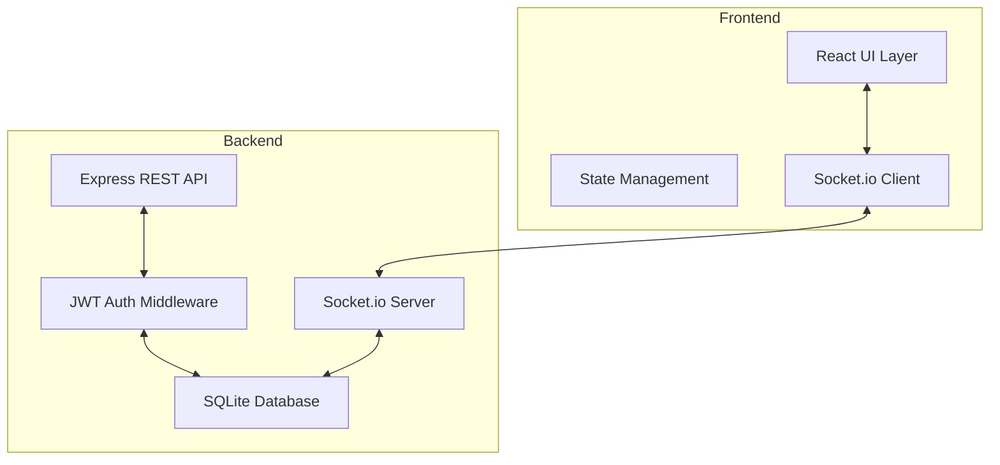

# Chat App Technical Design

Feature Name: chat-app
Updated: 2026-04-02

## Description

桌面聊天应用，支持用户注册登录、联系人管理和一对一文字聊天。采用 Electron + React 前端和 Node.js + Express + Socket.io 后端架构。

## Architecture



## Components and Interfaces

### Frontend Components

| Component | Responsibility |
|-----------|----------------|
| LoginView | 用户登录注册界面 |
| MainView | 主界面容器 |
| Sidebar | 侧边栏（联系人列表、搜索） |
| ChatArea | 聊天区域（消息列表、输入框） |
| MessageBubble | 消息气泡组件 |

### Backend API Endpoints

| Method | Endpoint | Description |
|--------|----------|-------------|
| POST | /api/auth/register | 用户注册 |
| POST | /api/auth/login | 用户登录 |
| GET | /api/contacts | 获取联系人列表 |
| POST | /api/contacts | 添加联系人 |
| DELETE | /api/contacts/:id | 删除联系人 |
| GET | /api/messages/:contactId | 获取与某联系人的消息历史 |

### WebSocket Events

| Event | Direction | Description |
|-------|-----------|-------------|
| message | bidirectional | 发送/接收聊天消息 |
| connect | client -> server | 建立连接 |
| disconnect | client -> server | 断开连接 |

## Data Models

### User Table

```sql
CREATE TABLE users (
    id INTEGER PRIMARY KEY AUTOINCREMENT,
    username TEXT UNIQUE NOT NULL,
    password_hash TEXT NOT NULL,
    created_at DATETIME DEFAULT CURRENT_TIMESTAMP
);
```

### Contact Table

```sql
CREATE TABLE contacts (
    id INTEGER PRIMARY KEY AUTOINCREMENT,
    user_id INTEGER NOT NULL,
    contact_id INTEGER NOT NULL,
    created_at DATETIME DEFAULT CURRENT_TIMESTAMP,
    FOREIGN KEY (user_id) REFERENCES users(id),
    FOREIGN KEY (contact_id) REFERENCES users(id)
);
```

### Message Table

```sql
CREATE TABLE messages (
    id INTEGER PRIMARY KEY AUTOINCREMENT,
    sender_id INTEGER NOT NULL,
    receiver_id INTEGER NOT NULL,
    content TEXT NOT NULL,
    created_at DATETIME DEFAULT CURRENT_TIMESTAMP,
    FOREIGN KEY (sender_id) REFERENCES users(id),
    FOREIGN KEY (receiver_id) REFERENCES users(id)
);
```

## Correctness Properties

1. 用户名唯一性：注册时检查用户名是否已存在
2. 消息顺序：按时间戳升序显示消息
3. 实时性：消息通过 WebSocket 实时推送
4. 会话安全：JWT token 有效期 24 小时

## Error Handling

| Scenario | Handling |
|----------|----------|
| 注册用户名已存在 | 返回 400 错误，提示用户名已被使用 |
| 登录密码错误 | 返回 401 错误，提示密码错误 |
| 发送消息失败 | 在 UI 显示重发按钮 |
| WebSocket 断开 | 自动尝试重连 |
| 数据库错误 | 记录日志，返回 500 错误 |

## Project Structure

```
/workspace/
├── frontend/           # Electron + React 前端
│   ├── src/
│   │   ├── components/
│   │   ├── pages/
│   │   ├── services/
│   │   └── App.tsx
│   └── package.json
├── backend/            # Node.js 后端
│   ├── src/
│   │   ├── routes/
│   │   ├── middleware/
│   │   ├── models/
│   │   └── index.js
│   └── package.json
└── SPEC.md             # 项目规范
```

## Test Strategy

1. **单元测试**: 后端 API 路由测试
2. **集成测试**: WebSocket 消息收发测试
3. **E2E 测试**: 完整用户流程测试
